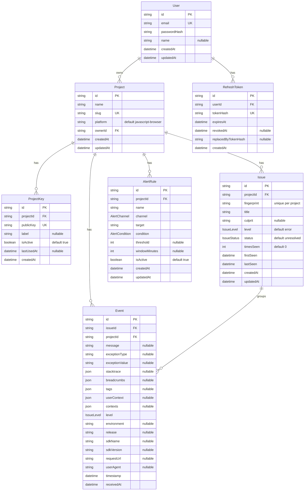

# ERD

`packages/server/prisma/schema.prisma` 기준. 상세 필드 설명은 [데이터 모델](/database/data-model.md) 참고.

## 표기
- `||--o{` : 1 : 다(0개 이상) 관계. PK=기본키, FK=외래키, UK=유니크.
- `Event`는 `issueId`와 함께 `projectId`도 직접 보유(비정규화) — 프로젝트 단위 조회 최적화용.

## 관련 개념
- [데이터 모델](/database/data-model.md) · [프로젝트 개요](/overview/mini-sentry.md)
