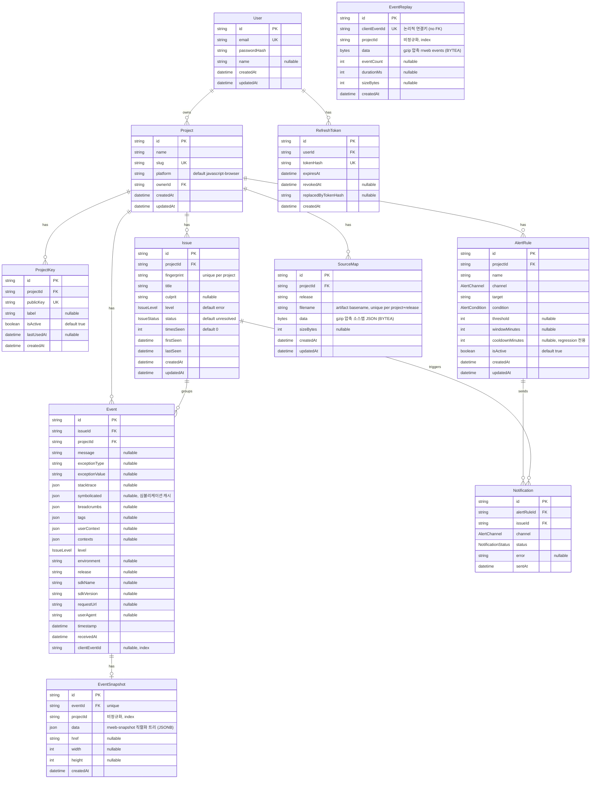

# ERD

`packages/server/prisma/schema.prisma` 기준. 상세 필드 설명은 [데이터 모델](/database/data-model.md) 참고.

## 엔티티 설명
각 엔티티가 무엇을 나타내는지. 필드 상세는 [데이터 모델](/database/data-model.md).

| 엔티티 | 설명 |
|---|---|
| `User` | 계정. 로그인 주체이며 프로젝트의 소유자. |
| `Project` | 모니터링 대상 프로젝트(에러를 수집할 단위). 한 사용자가 소유. |
| `ProjectKey` | 인제스트용 공개키. SDK가 이벤트를 보낼 때 쓰는 **DSN의 기반**. |
| `Issue` | 같은 `fingerprint`로 **묶인 에러 그룹**(프로젝트 내 유일). 상태/레벨/누적횟수를 가짐. |
| `Event` | **개별 에러 발생 1건**(스택트레이스·breadcrumb 등 원본). 하나의 Issue에 묶임. `clientEventId`로 리플레이와 논리적 연결. `symbolicated` 컬럼에 소스맵 심볼리케이션 결과 캐시. |
| `AlertRule` | 알림 규칙(조건·채널·임계치). 어떤 상황에 누구에게 알릴지 정의. |
| `Notification` | **알림 전송 1건의 기록**(디듀프 + 감사). 어떤 규칙이 어떤 이슈로 보냈는지. |
| `RefreshToken` | 리프레시 토큰. 회전·폐기를 추적(재사용 탐지). |
| `EventSnapshot` | 에러 발생 시점에 캡처한 **마스킹된 DOM 스냅샷** 1건(feature B). `Event`와 1:1 대응. |
| `EventReplay` | 에러 직전 **~30초 rrweb 세션 녹화**(feature C). `clientEventId` unique로 SDK 재전송 upsert 지원. `Event`와 DB FK 없이 `clientEventId`로 논리적 연결. |
| `SourceMap` | **릴리스별 소스맵 1개**(artifact basename 단위). gzip 압축 소스맵 JSON을 BYTEA로 저장. 이벤트 조회 시 스택트레이스 심볼리케이션에 사용됨. |

## 관계 설명
다이어그램의 각 선(`||--o{` = 1 : 다)이 뜻하는 것.

| 관계 | 의미 |
|---|---|
| `User ||--o{ Project` | 한 사용자가 **여러 프로젝트를 소유**한다(`Project.ownerId`). |
| `User ||--o{ RefreshToken` | 한 사용자가 **여러 리프레시 토큰**을 가진다(로그인 세션마다). |
| `Project ||--o{ ProjectKey` | 한 프로젝트가 **여러 인제스트 키**를 가진다(키 회전·다중 환경). |
| `Project ||--o{ Issue` | 한 프로젝트에 **여러 이슈**가 쌓인다. |
| `Project ||--o{ Event` | 한 프로젝트에 **여러 이벤트**가 직접 연결된다(아래 비정규화 노트 참고). |
| `Project ||--o{ AlertRule` | 한 프로젝트가 **여러 알림 규칙**을 가진다. |
| `Issue ||--o{ Event` | 하나의 이슈가 **여러 이벤트를 묶는다**(같은 에러의 반복 발생). |
| `AlertRule ||--o{ Notification` | 한 규칙이 **여러 알림 전송 기록**을 남긴다. |
| `Issue ||--o{ Notification` | 하나의 이슈가 (규칙을 통해) **여러 번 알림을 발생**시킨다. |
| `Event ||--o| EventSnapshot` | 하나의 이벤트가 **0 또는 1개의 DOM 스냅샷**을 가진다(1:0..1). 스냅샷이 없는 이벤트도 존재한다. |
| `Event` ↔ `EventReplay` | **DB 관계 없음**. `Event.clientEventId`와 `EventReplay.clientEventId`가 같은 값이면 논리적으로 연결된다(0..1 대응). 리플레이가 이벤트보다 먼저 도착할 수 있으므로 FK 대신 `clientEventId` unique+upsert로 처리한다. 다이어그램에서 선으로 표시하지 않음. |
| `Project ||--o{ SourceMap` | 한 프로젝트가 **여러 소스맵**을 가진다(릴리스×artifact basename 단위). `onDelete: Cascade`로 프로젝트 삭제 시 연쇄 삭제. |

## 표기 / 주의
- `||--o{` : 1 : 다(0개 이상). `||--o|` : 1 : 0..1. `PK`=기본키, `FK`=외래키, `UK`=유니크.
- **비정규화**: `Event`는 `issueId`와 함께 `projectId`도 직접 보유 — 프로젝트 단위 조회 최적화용(Issue를 거치지 않고 바로 필터).
- **비정규화(EventSnapshot, EventReplay)**: 두 테이블 모두 `projectId`를 직접 보유(project-scope 쿼리 최적화용). `Project`에 대한 직접 FK는 없다.
- **best-effort 저장(EventSnapshot)**: `EventSnapshot`은 메인 트랜잭션 바깥에서 삽입 — 스냅샷 저장 실패가 `Event` 저장을 롤백하지 않는다.
- **EventReplay는 FK 없음**: 리플레이가 이벤트 처리보다 먼저 도착할 수 있어 DB FK 대신 `clientEventId` unique+upsert로 연결한다. SDK 재전송(keepalive re-send)도 upsert로 멱등 처리된다.
- **디듀프**: 워커가 `Notification`의 `pending` 행을 advisory lock으로 선점해 동시 중복 발송을 막는다([알림 규칙 API](/api/alerts-api.md)).
- 모든 FK는 부모 삭제 시 `onDelete: Cascade`(User 삭제 → 그 프로젝트·토큰·이슈·이벤트·스냅샷 등 연쇄 삭제). `EventReplay`는 FK가 없으므로 Cascade 미적용.
- **리플레이 보관 한도 없음**: 현재 `EventReplay`에 TTL/quota 정책 없음(추후 과제).
- **SourceMap.filename은 basename**: 저장 전 `frameBasename()`으로 URL/경로/쿼리·해시를 제거한 basename으로 정규화한다. `(projectId, release, filename)` unique 복합키 — 동명 artifact는 upsert로 덮어쓰인다.
- **SourceMap.data는 전량 메모리 로드**: 이벤트 조회 시 해당 릴리스의 소스맵을 전부 DB에서 읽어 gunzip한다. 대용량·다수 릴리스에서 메모리 부담 가능(알려진 한계, [소스맵 API](/api/sourcemaps-api.md) 참고).

## 관련 개념
- [데이터 모델](/database/data-model.md) · [프로젝트 개요](/overview/mini-sentry.md) · [소스맵 API](/api/sourcemaps-api.md)
